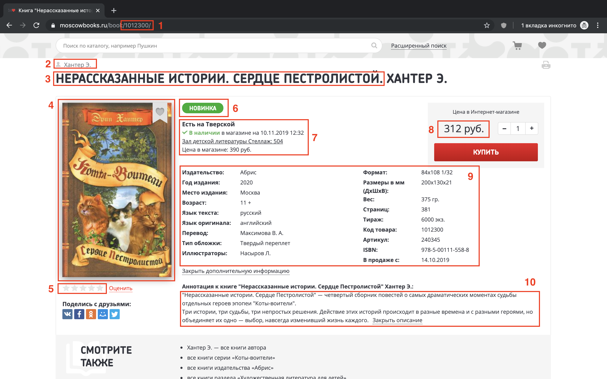

# Домашнее задание №3

В этом задании требуется обкачать книжный магазин ["Москва"](https://www.moscowbooks.ru/) с использованием библиотек [BeautifulSoup](https://www.crummy.com/software/BeautifulSoup/bs4/doc/) и [lxml](https://lxml.de/). Ваша программа должна скачать информацию обо всех книгах в магазине следующих авторов:
- Федор Михайлович Достоевский;
- Джеймс Роллинс;
- Фрэнсис Скотт Фицджеральд;
- Дмитрий Глуховский;
- Аркадий и Борис Стругацкие;
- Сергей Лукьяненко;
- Макс Фрай;
- Эрин Хантер;
- Джоан Роулинг.

Результатом работы вашей программы должен быть файл `hw_3.csv` с таблицей из всех найденных книг.

## Общий подход к решению задачи

Задачу условно можно разделить на два этапа. На первом этапе требуется получить все ссылки на книги автора, на втором — получить информацию о каждой из книг.

### Этап 1. Получение ссылок на книги автора

Для поиска всех книг автора мы будем пользоваться специально подготовленными страницами на сайте магазина. Формат URL-ов страниц имеет вид:
```
https://www.moscowbooks.ru/catalog/author/{author_id}
```
где вместо `{author_id}` подставляется id автора.

Список id для требуемых авторов:
```json
{
  "Достоевский Ф. М.": 9150,
  "Роллинс Дж.": 59396,
  "Фицджеральд Ф. С.": 28727,
  "Глуховский Д. А.": 53427,
  "Стругацкий А. Н.": 26268,
  "Лукьяненко С. В.": 16626,
  "Фрай М.": 28927,
  "Хантер Э.": 37969,
  "Роулинг Дж. К.": 104832
}
```

Существует несколько способов получить ссылку на карточку книги:
1. получить атрибут `data-productid` одного из тегов `a data-prices` и использовать знание о формате URL-ов страничек с книгами;
2. непосредственно найти ссылку на карточку.

### Этап 2. Получение информации о книгах

Рассмотрим в качестве примера [карточку](https://www.moscowbooks.ru/book/1012300/) книги Эрин Хантер "Нерассказанные истории. Сердце Пестролистой".



На скриншотах выделены 10 областей, из каждой области требуется извлечь следующие элементы:
1. поле "ID" (id-карточки);
2. поле "Автор" (если авторов несколько, укажите всех через запятую);
3. поле "Название" (название не должно содержать имя автора, не обязательно излекать поле из этого тега);
4. поле "Обложка" (полный абсолютный путь);
5. поле "Рейтинг" (число закрашенных звезд);
6. поле "Стикеры" (если стикеров несколько, перечислите все через точку с запятой);
7. поле "Наличие" (индикатор, что книга есть в магазине);
8. поле "Цена";
9. все поля из таблицы;
10. описание книги.

Таким образом карточка из примера представима в виде следующего словаря:
```json
{
    "Код товара": 1012300,
    "Автор": "Хантер Э.",
    "Название": "Нерассказанные истории. Сердце Пестролистой",
    "Наличие": true,
    "Описание": "\"Нерассказанные истории. Сердце Пестролистой\" — четвертый сборник повестей о самых драматических моментах судьбы отдельных героев эпопеи \"Коты-воители\". Три истории, три судьбы, три непростых решения. Действие этих историй происходит в разные времена и с разными героями, но объединяет их одно — выбор, навсегда изменивший жизнь каждого.",
    "Рейтинг": 0,
    "Обложка": "https://www.moscowbooks.ru/image/book/675/w259/i675354.jpg",
    "Стикеры": "Новинка",
    "Издательство": "Абрис",
    "Год издания": "2020",
    "Место издания": "Москва",
    "Возраст": "11 +",
    "Язык текста": "русский",
    "Язык оригинала": "английский",
    "Перевод": "Максимова В. А.",
    "Тип обложки": "Твердый переплет",
    "Иллюстраторы": "Насыров Л.",
    "Формат": "84х108 1/32",
    "Размеры в мм (ДхШхВ)": "200x130x21",
    "Вес": "375 гр.",
    "Страниц": "381",
    "Тираж": "6000 экз.",
    "Артикул": "240345",
    "ISBN": "978-5-00111-558-8",
    "В продаже с": "14.10.2019"
}
```
Обратите внимание, что некоторые поля, например: "Возраст", "Язык оригинала", "Стикеры" — отсутствуют именно для этой карточки, но могут присутствовать в других карточках, см. таблицы и стикеры, например, [карточки #1](https://www.moscowbooks.ru/book/995751) и [карточки #2](https://www.moscowbooks.ru/book/1011379/).

Предположим, что у нас есть функция `extract_book_info(book_id)`, которая для карточки с номером `book_id` возвращает описанный выше словарь. Тогда требуемую таблицу можно получить следующим образом:
```python
import pandas as pd

result = list(map(extract_book_info, book_ids))
df = pd.DataFrame(result)
df.sort_values(by=['ID'], inplace=True)

with open('data/hw_3.csv', mode='w', encoding='utf-8') as f_csv:
    df.to_csv(f_csv, index=False)
```

Пример результата работы программы можно найти [здесь](hw3_sample.csv).

В данном задании вы строите небольшую, но все же систему для обкачки сайтов. Поэтому полезно логировать ее состояние, например, писать сколько книг уже было обработано. В случае параллельной обработки данных, для этого вам потребуется использовать мьютексы (или локи) и счетчики. Ниже приведен пример для пула процессов. 

```python
from multiprocessing import Pool, Lock, Value
from time import sleep

mutex = Lock()
n_processed = Value('i', 0)

def func(uid):
    sleep(0.5) # логика работы функции
    return uid

def func_wrapper(uid):
    res = func(uid) 
    with mutex:
        # в этом блоке можно безопасно менять общие объекты для процессов
        global n_processed
        n_processed.value += 1
        if n_processed.value % 10 == 0:
            print(f"\r{n_processed.value} objects are processed...", end='', flush=True)
    return res

with Pool(processes=10) as pool:
    res = pool.map(func_wrapper, range(40))
```

Ответьте на вопрос, почему для счетчика мы ипользуем объект Value, а не обычную переменную.

## Общие рекомендации по выполнению задания

1. Не смешивайте этапы задания вместе. Сначала получите все id карточек для всех авторов, а затем для каждой карточки извлеките требуемую информацию.
2. Используйте возможности параллельной работы с данными Python, например, модуль multiprocessing.
